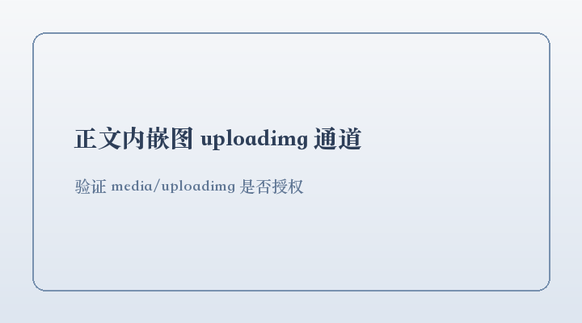

这是一篇通过公众号服务端 API 创建的**测试草稿**，用于验证发布链路的可行性。

> 路线 B：API 负责内容生产，人工在后台点「发表」。该账号未认证，`freepublish/*` 不可用。

## 已验证可用

- `stable_token` / `token` — 凭证有效
- `material/add_material` — 封面永久素材
- `media/uploadimg` — 正文图片
- `draft/add` — 建草稿

## 不可用（需认证）

- `freepublish/submit`、`freepublish/get` — 发布
- `message/mass/sendall` — 群发
- `user/info` — 用户管理

发布于 2026-09-27 · 可在草稿箱删除
